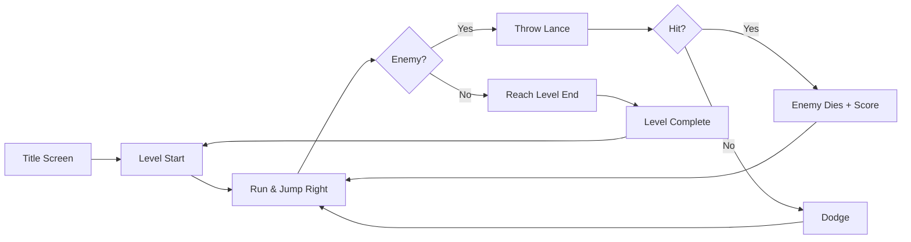

# ClaudeGoblin — Game Design Document

## Concept

A faithful clone of Ghost 'n Goblins (Capcom, 1985) starring Claude —
Anthropic's orange mascot — as the hero, navigating a graveyard full of
undead horrors to rescue the kidnapped AI princess.

## Core Loop

## Player — Claude

- **Appearance**: Orange 32×32 sprite, armored in orange plate armor; unarmored shows
  Claude in his signature orange jumpsuit
- **Movement**: Fixed horizontal speed (120 px/s), locked mid-air (authentic GnG feel)
- **Attack**: Throws lances horizontally; one at a time on screen
- **Health**: Two hits = death
  - Hit 1 (armored) → armor destroyed, briefly invincible
  - Hit 2 (unarmored) → lose a life, respawn armored at checkpoint

## Enemies

| Name | Movement | Hits to Kill |
|------|----------|--------------|
| Zombie | Walks toward player, slow | 1 |
| Flying Knight | Sine-wave flight toward player | 1 |

## Levels

### Level 1 — The Graveyard

- Scrolling left-to-right
- Platforms: tombstones, broken walls
- Enemies: Zombies spawn from graves, Flying Knights swoop from above
- One armor pickup hidden in a chest midway
- Boss: (out of scope for v1)

## Controls

| Action | Keys |
|--------|------|
| Move | Arrow Keys / A-D |
| Jump | Space / Up Arrow |
| Attack | Z or X |

## Scoring

| Event | Points |
|-------|--------|
| Zombie killed | 100 |
| Flying Knight killed | 200 |
| Level complete | 1000 |
